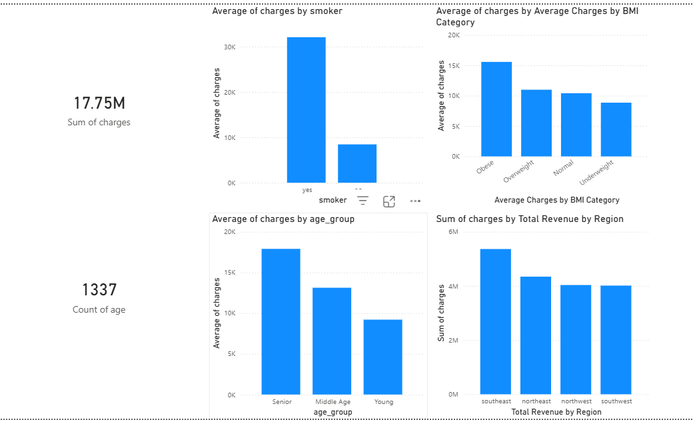
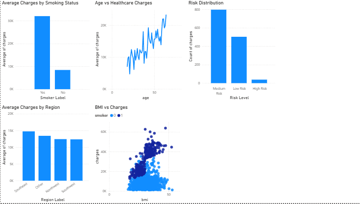

<!DOCTYPE html>
<html lang="en">
<head>
<meta charset="UTF-8">
<meta name="viewport" content="width=device-width, initial-scale=1.0">
</head>
<body>

<h1>🩺 Healthcare Data Analytics & Insurance Cost Dashboard</h1>

This project analyzes healthcare insurance data to understand the factors influencing medical costs.

Using <strong>Python, SQL, and Power BI</strong>, the project transforms raw healthcare datasets into actionable insights through a structured analytics workflow:

<strong>Data Collection → Data Cleaning → Feature Engineering → Exploratory Data Analysis → SQL Analytics → Power BI Dashboard</strong>

<h2>📊 Project Status</h2>

✅ <strong>Project Completed</strong>

<h2>🚀 How to Run this Project</h2>

<a href="docs/how-to-run.md">📖 Complete Step-by-Step Guide</a>

<h2>📊 Dashboard Preview</h2>

<strong>Healthcare Cost Dashboard</strong>

  

<h2>📈 Key Insights</h2>

<ul>
<li>Smoking significantly increases healthcare insurance charges</li>
<li>Patients categorized as <strong>High Risk</strong> have the highest treatment costs</li>
<li>The <strong>Obese BMI category</strong> shows higher average medical expenses</li>
<li><strong>Senior patients</strong> tend to have higher treatment costs</li>
<li>The <strong>Southeast region</strong> generates the highest healthcare revenue</li>
</ul>

<h2>🛠 Skills Demonstrated</h2>

<ul>
<li>Data Cleaning using <strong>Python (Pandas)</strong></li>
<li>Feature Engineering (Encoding + Analytical Features)</li>
<li>Exploratory Data Analysis (EDA)</li>
<li>Data Visualization using <strong>Matplotlib</strong></li>
<li>SQL Analytics using <strong>MySQL</strong></li>
<li>Automated Insight Generation (Rule-Based)</li>
<li>Business Insight Generation</li>
<li>Interactive Dashboard Development using <strong>Power BI</strong></li>
</ul>

<h2>🏗️ Project Structure</h2>

<pre>
healthcare-data-analytics/
│
├── README.md
│
├── data/
│   ├── raw/
│   │   └── healthcare_raw.csv
│   └── processed/
│       └── healthcare_cleaned.csv
│
├── notebooks/
│   └── healthcare_analysis.ipynb
│
├── scripts/
│   ├── data_cleaning.py
│   ├── feature_engineering.py
│   ├── eda_analysis.py
│   └── insight_generator.py
│
├── sql/
│   ├── create_database.sql
│   ├── create_tables.sql
│   └── healthcare_queries.sql
│
├── dashboard/
│   └── healthcare_dashboard.pbix
│
├── images/
│   ├── dashboard_overview1.png
│   └── dashboard_overview2.png
│
└── docs/
    ├── project_overview.md
    ├── dataset_description.md
    └── methodology.md
</pre>

<h2>🚀 Implementation Phases</h2>

<h3>🟩 Phase 1 – Dataset Collection</h3>
<ul>
<li>Dataset obtained from Kaggle</li>
<li>Dataset structure analysis</li>
<li>Identification of missing values</li>
<li>Definition of healthcare KPIs</li>
</ul>

<strong>Status:</strong> ✅ Completed

<h3>🟨 Phase 2 – Data Cleaning & Preprocessing</h3>
<ul>
<li>Checked missing values</li>
<li>Removed duplicate records</li>
<li>Verified dataset structure</li>
<li>Exported cleaned dataset</li>
</ul>

<strong>Status:</strong> ✅ Completed

<h3>🟦 Phase 3 – Feature Engineering & Exploratory Data Analysis</h3>

<h4>🔸 Feature Engineering</h4>
<ul>
<li>Encoding categorical variables (Sex, Smoker)</li>
<li>Create Age Groups (Young, Adult, Senior)</li>
<li>Create BMI Categories (Underweight, Normal, Overweight, Obese)</li>
<li>Create Family Size</li>
<li>Create Risk Level Segmentation</li>
</ul>

<h4>🔸 Univariate Analysis</h4>
<ul>
<li>Age Distribution</li>
<li>BMI Distribution</li>
<li>Charges Distribution</li>
<li>Outlier Detection using Boxplots</li>
</ul>

<h4>🔸 Bivariate Analysis</h4>
<ul>
<li>Age vs Charges</li>
<li>Smoker vs Charges</li>
<li>Gender vs Charges</li>
<li>Region vs Charges</li>
</ul>

<h4>🔸 Multivariate Analysis</h4>
<ul>
<li>Age + Smoker vs Charges</li>
<li>BMI + Smoker vs Charges</li>
<li>Family Size vs Charges</li>
</ul>

<h4>🔸 Correlation Analysis</h4>
<ul>
<li>Correlation Heatmap</li>
<li>Identification of strong relationships</li>
</ul>

<strong>Status:</strong> ✅ Completed

<h3>🟧 Phase 4 – SQL Analytics</h3>
<ul>
<li>Average charges by region</li>
<li>Smoker vs non-smoker cost comparison</li>
<li>Age group-based analysis</li>
<li>Top high-cost patients</li>
<li>Advanced queries using CASE, GROUP BY, subqueries</li>
</ul>

<strong>Status:</strong> strong> ✅ Completed

<h3>🟥 Phase 5 – Power BI Dashboard</h3>
<ul>
<li>Total revenue KPI</li>
<li>Average treatment cost KPI</li>
<li>Smoking cost comparison</li>
<li>Age group analysis</li>
<li>BMI category analysis</li>
<li>Region-wise revenue visualization</li>
<li>Risk level segmentation</li>
</ul>

<strong>Status:</strong> strong> progress ⏳

<h2>🚀 Advanced Analytics Features (NEW 🔥)</h2>

<h3>🔹 Automated Insight Generator</h3>
<ul>
<li>Rule-based system to generate insights automatically</li>
<li>Identifies high-cost groups</li>
<li>Compares smoker vs non-smoker costs</li>
<li>Detects highest cost region</li>
</ul>

<h3>🔹 Percentage-Based Insights</h3>
<ul>
<li>Calculated % increase in smoker cost</li>
<li>Compared cost differences across regions</li>
</ul>

<h3>🔹 Risk Group Identification</h3>
<ul>
<li>High Risk → Smoker + High BMI + Age > 50</li>
<li>Medium Risk → Moderate conditions</li>
<li>Low Risk → Healthy individuals</li>
</ul>

<h3>🔹 Business Insights</h3>
<ul>
<li>Smoking is the major cost-driving factor</li>
<li>Obesity increases healthcare expenses</li>
<li>Senior individuals contribute to higher costs</li>
</ul>

<h3>🔹 Recommendations</h3>
<ul>
<li>Promote smoking cessation programs</li>
<li>Encourage healthy lifestyle</li>
<li>Focus on preventive healthcare</li>
</ul>

<h2>🛠 Technical Stack</h2>

<table border="1" cellpadding="8" cellspacing="0">
<tr><th>Category</th><th>Tools</th></tr>
<tr><td>Data Processing</td><td>Python, Pandas, NumPy</td></tr>
<tr><td>Visualization</td><td>Matplotlib, Power BI</td></tr>
<tr><td>Database</td><td>MySQL</td></tr>
<tr><td>Analysis</td><td>Jupyter Notebook</td></tr>
<tr><td>Version Control</td><td>Git, GitHub</td></tr>
</table>

<h2>🎯 Workflow Pipeline</h2>

<pre>
Healthcare Dataset (CSV)
        ↓
Data Cleaning (Python / Pandas)
        ↓
EDA + Feature Engineering
        ↓
SQL Analytics
        ↓
Power BI Dashboard
        ↓
Automated Insights + Business Recommendations
</pre>

<h2>💼 Interview Talking Point</h2>

<strong>
Developed an end-to-end healthcare data analytics system integrating Python, SQL, and Power BI. Performed data cleaning, feature engineering, and advanced exploratory analysis. Built a rule-based automated insight generator to extract key patterns and designed an interactive dashboard to support business decision-making.
</strong>

<strong>Healthcare Data Analytics Project 🩺📊</strong>

</body>
</html>